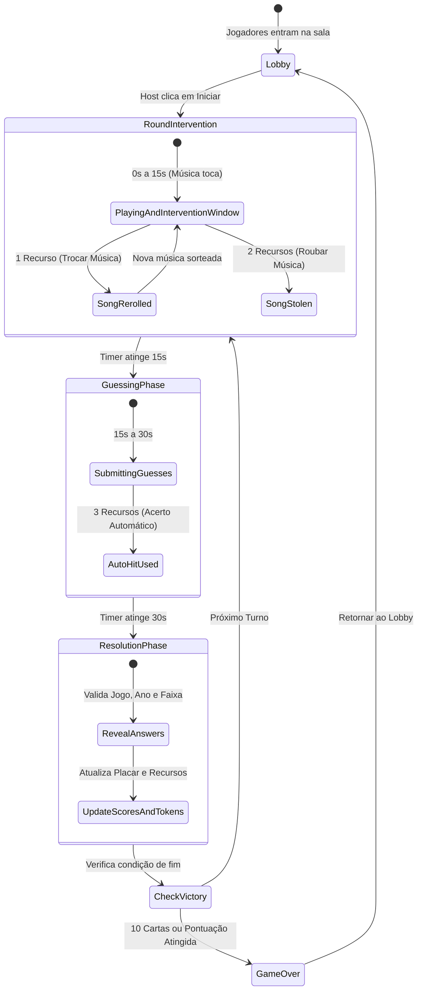

# Especificação de Arquitetura e Infraestrutura — Gamester

## 1. Visão Geral da Arquitetura

O **Gamester** foi projetado com uma premissa fundamental: **baixo consumo de recursos computacionais** para conviver de forma estável em uma VPS compartilhada com instâncias de **Foundry VTT** e **TeamSpeak**, sob proxy reverso **Nginx** e proteção de borda da **Cloudflare**.

```
                           [ Navegador dos Amigos (Desktop/Mobile) ]
                                              │
                                              ▼ (HTTPS / WSS)
                                      [ Cloudflare Edge ]
                                   (DNS, SSL, CDN Caching)
                                              │
                                              ▼ (Proxy Reverso)
                                       [ Nginx na VPS ]
                                              │
                   ┌──────────────────────────┴──────────────────────────┐
                   │                                                     │
                   ▼ (Porta 3030)                                        ▼ (Outros Serviços)
        [ Gamester (Single Container/Node.js) ]               [ Foundry VTT ] [ TeamSpeak ]
        ├── HTTP Server (Fastify / Express leve)
        ├── WebSocket Server (ws / socket.io)
        ├── SQLite Embutido (gamester.db)
        └── Audio Manager
             ├── YouTube IFrame API (Headless Client)
             └── Local Audio Cache (/media/*.opus)
```

---

## 2. Dimensionamento e Restrições da VPS

Para não prejudicar a estabilidade do Foundry VTT (que consome memória para nós do Node.js e mapas) e do TeamSpeak (que exige baixa latência em UDP):

| Componente | Decisão Arquitetural | Consumo Estimado |
| :--- | :--- | :--- |
| **Backend Runtime** | Node.js com Fastify ou Bun (Single Process) | 40 MB – 80 MB RAM |
| **Banco de Dados** | SQLite via arquivo local (`better-sqlite3`) | 0 MB em daemon (embutido no processo) |
| **Frontend Assets** | SPA compilada (Vite + Svelte/Vue) servida pelo Nginx/Fastify | 0 MB RAM adicional |
| **Total de Recursos**| **Aplicação Completa** | **< 100 MB RAM** e **< 2% CPU** em repouso |

> [!IMPORTANT]
> **Proibição de Daemons Pesados:** Não será utilizado PostgreSQL, MySQL, Redis ou MongoDB em containers separados na VPS. Toda a persistência em disco é mantida em um único arquivo `gamester.db` (SQLite) com WAL mode ativo para alta performance em leituras simultâneas.

---

## 3. Estratégia de Áudio: YouTube Headless vs Áudio Próprio

Para atender à necessidade de não sobrecarregar a VPS e mitigar riscos legais, o Gamester adota uma **estratégia híbrida**:

### Abordagem Principal: YouTube IFrame API (Headless)
- **Como funciona:** O cliente web carrega o player oficial do YouTube via IFrame com visualização oculta (`opacity: 0; pointer-events: none; width: 1px; height: 1px; position: absolute;`).
- **Prevenção de Spoilers:** O player nunca é exibido durante os 30 segundos de adivinhação. Título do vídeo, canal e miniatura permanecem inacessíveis visualmente para o jogador.
- **Sincronização:** O servidor envia via WebSocket apenas o `videoId` e o `startTime` (em segundos). Ao receber o comando, o frontend chama:
  ```javascript
  player.loadVideoById({
    videoId: song.youtubeId,
    startSeconds: song.startTime,
    endSeconds: song.startTime + 30
  });
  ```
- **Vantagens:** 
  - Zero uso de disco na VPS para áudios;
  - Zero consumo de banda de saída (o streaming vem direto dos servidores do Google/YouTube);
  - Amparo sob os termos de incorporação pública do YouTube (o YouTube monetiza/exibe licenças devidamente para os detentores de direitos).
- **Tratativas de Limitações:**
  - *Autoplay:* Navegadores exigem interação do usuário antes de tocar áudio. Ao clicar em "Entrar no Lobby" ou "Estou Pronto", o jogo inicializa o contexto de áudio.
  - *Vídeos Indisponíveis:* O painel administrativo possui botão de teste para validar se o vídeo aceita incorporação antes de ser adicionado à rotação.

### Abordagem Secundária: Clipes Locais Comprimidos (Fallback / Arquivo Local)
- O sistema permite apontar faixas para arquivos de áudio locais (formato `.opus` ou `.ogg` a 64 kbps mono/joint-stereo).
- Um trecho de 30 segundos em Opus 64kbps tem aproximadamente **240 KB**.
- Um acervo de 500 músicas consome apenas **~120 MB de disco**.
- Esses arquivos podem ser servidos diretamente como estáticos pelo Nginx com cabeçalhos de cache agressivos para a Cloudflare (`Cache-Control: public, max-age=31536000`).

---

## 4. Gerenciamento do Catálogo de Músicas

O sistema fornece **duas vias** de alimentação do catálogo:

### 1. Importação em Lote via IA (JSON / CLI)
Estrutura padronizada para geração automatizada via prompts com LLMs (ChatGPT, Gemini, Claude). O administrador pode importar arquivos `.json` diretamente pelo painel ou via comando CLI:

```json
[
  {
    "gameTitle": "Chrono Trigger",
    "releaseYear": 1995,
    "songTitle": "Wind Scene",
    "youtubeUrl": "https://www.youtube.com/watch?v=5ejTEpMhp_8",
    "startTime": 12,
    "platform": "Super Nintendo",
    "category": "Retro",
    "tags": ["snes", "rpg", "overworld", "classic"],
    "aliases": ["Chrono", "CT"]
  },
  {
    "gameTitle": "Hollow Knight",
    "releaseYear": 2017,
    "songTitle": "City of Tears",
    "youtubeUrl": "https://www.youtube.com/watch?v=1unmFCyiVM8",
    "startTime": 45,
    "platform": "Multi",
    "category": "Indie",
    "tags": ["indie", "metroidvania", "ambient"],
    "aliases": ["HK"]
  }
]
```

### 2. Interface Administrativa Web (`/admin`)
- Tela simples e protegida por senha de administrador (`ADMIN_SECRET_KEY`).
- Formulário com campos: *Nome do Jogo*, *Ano*, *Nome da Música*, *Link do YouTube*, *Segundo Inicial*.
- **Player de Pré-escuta:** Permite ao administrador clicar em "Testar Trecho" para escutar exatamente os 30 segundos a partir do segundo inicial antes de salvar.
- Tabela com busca, paginação, contagem de faixas e botão para excluir/editar.

---

## 5. Protocolo de Comunicação e Máquina de Estados da Rodada

A sincronização de partida opera via **WebSockets**, com o backend mantendo autoridade absoluta de tempo e regras.

### Diagrama de Estados da Rodada



### Eventos Principais do WebSocket

| Evento | Origem | Descrição |
| :--- | :--- | :--- |
| `room:join` | Cliente $\rightarrow$ Servidor | Jogador entra com `roomId` e `nickname`. |
| `game:start` | Host $\rightarrow$ Servidor | Dispara o início da partida. |
| `round:start` | Servidor $\rightarrow$ Todos | Informa início da rodada, jogador da vez, `youtubeId`, `startTime` e timestamps de término. |
| `power:reroll` | Cliente $\rightarrow$ Servidor | Jogador gasta 1 recurso para trocar a música atual (válido até 15s). |
| `power:steal` | Cliente $\rightarrow$ Servidor | Jogador gasta 2 recursos para roubar a música atual (válido até 15s). |
| `power:autohit` | Cliente $\rightarrow$ Servidor | Jogador da vez gasta 3 recursos para acerto automático. |
| `guess:submit` | Cliente $\rightarrow$ Servidor | Submete palpite de jogo, posição de linha do tempo e nome da faixa. |
| `round:reveal` | Servidor $\rightarrow$ Todos | Revela dados da música, acertos, atualizações de linha do tempo e novos saldos de recursos. |

---

## 6. Configuração do Proxy Reverso Nginx

Exemplo de bloco de configuração pronto para ser adicionado ao Nginx existente na VPS, com suporte a SSL (terminado na Cloudflare ou Certbot) e suporte nativo a WebSockets:

```nginx
# /etc/nginx/sites-available/gamester.meudominio.com

map $http_upgrade $connection_upgrade {
    default upgrade;
    ''      close;
}

server {
    listen 80;
    server_name gamester.meudominio.com;

    # Se usar Cloudflare com SSL "Full" ou Certbot, redireciona 80 -> 443
    return 301 https://$host$request_uri;
}

server {
    listen 443 ssl http2;
    server_name gamester.meudominio.com;

    # Certificados SSL (Origin Cloudflare ou Let's Encrypt)
    ssl_certificate /etc/ssl/certs/gamester.pem;
    ssl_certificate_key /etc/ssl/private/gamester.key;

    # Otimização de buffers para baixo uso de RAM
    client_max_body_size 10M;

    location / {
        proxy_pass http://127.0.0.1:3030;
        proxy_http_version 1.1;

        # Cabeçalhos essenciais para WebSockets
        proxy_set_header Upgrade $http_upgrade;
        proxy_set_header Connection $connection_upgrade;

        proxy_set_header Host $host;
        proxy_set_header X-Real-IP $remote_addr;
        proxy_set_header X-Forwarded-For $proxy_add_x_forwarded_for;
        proxy_set_header X-Forwarded-Proto $scheme;

        # Timeouts longos para manter conexões WebSocket ativas
        proxy_read_timeout 86400s;
        proxy_send_timeout 86400s;
    }

    # Cache de áudios locais caso sejam utilizados
    location /media/ {
        proxy_pass http://127.0.0.1:3030/media/;
        expires 30d;
        add_header Cache-Control "public, no-transform";
    }
}
```

---

## 7. Módulo de Comparação de Strings (`StringMatcher`)

Para garantir alta tolerância a digitações imperfeitas sem sobrecarregar a CPU do servidor, o backend implementará uma rotina otimizada de normalização e cálculo de **Damerau-Levenshtein**:

### Estratégia de Processamento
1. **Pré-Normalização:** Remoção de acentos (`normalize("NFD")`), caracteres não alfanuméricos e **remoção de todos os espaços em branco**.
2. **Comparação Direta:** Se a string colapsada for estritamente igual à resposta ou a qualquer um dos `aliases`, retorna acerto imediatamente ($O(1)$).
3. **Cálculo de Damerau-Levenshtein:** Caso não seja idêntica, calcula a distância com tolerância dinâmica:
   - Permite transposição de letras adjacentes (ex: `zelad` $\rightarrow$ `zelda`).
   - Evita falso-positivo em palavras curtas aplicando limite rígido de acordo com o tamanho da resposta.
   - Emite status `'CORRECT'`, `'CLOSE'` (por pouco) ou `'WRONG'`.

